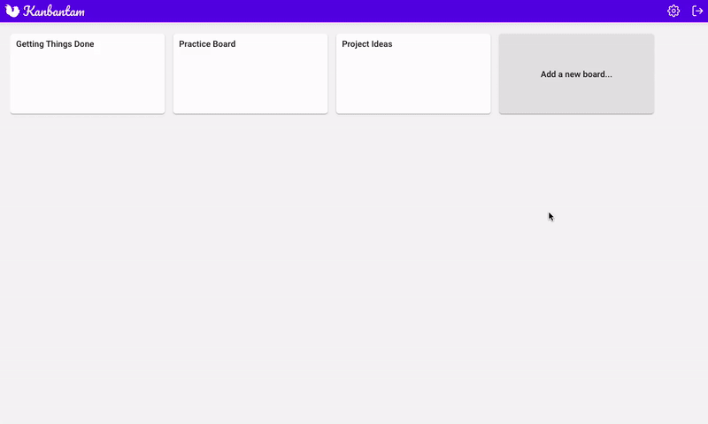

# Kanbantam

Kanbantam is a Trello-inspired Kanban app on steroids.

## Screenshots



## Tech/Framework Used

- [React](https://facebook.github.io/react/) - View Library
- [Redux](http://redux.js.org/) - State Manager
- [React-beautiful-dnd](https://github.com/atlassian/react-beautiful-dnd)
- [Webpack](https://webpack.github.io/) - Module Bundler
- [Express](http://expressjs.com/) - Node Application Framework
- [MongoDB](https://www.mongodb.com/) - Document Database
- [Mongoose](http://mongoosejs.com/) - MongoDB Framework
- [Passport](http://www.passportjs.org/) - Authentication Framework
- [React Notification System](http://igorprado.com/react-notification-system/) - Notification System
- [Ramda](http://ramdajs.com/) - Functional Library
- [ESLint](http://eslint.org/) - Code Linter

## Features

- Create, edit, remove, reorder todos, lists, and boards
- Add time, category, priority, due date to todos
- Run a pomodoro timer and track finished pomodori
- Create categories, default lists, minutes
- Enable focus mode
- Supports GitHub flavored markdown

## Installation

1. Clone the project
2. Run `yarn` or `npm install` (this will install all the dependencies)

   ```shell
   yarn
   ```

3. Make sure you add your own mongoDB url. Create a `.env` file in the root directory with the following variables:

   ```
   DATABASE_URL
   SESSION_SECRET
   PORT=4000
   ```

4. Run `yarn dev` and `yarn start:dev` (this will run the application on `localhost:4000`)

   ```shell
   yarn start:dev
   yarn dev
   ```

## How to use?

If you would like to demo the finished project, you can do that here: https://kanbantam.com/. If you prefer running the project locally you can achieve that with the instructions in the `Installation` section.

## Contribute

Feel free to dive in! [Open an issue](https://github.com/amelieoller/kanbantam/issues/new) or submit PRs.

Standard Readme follows the [Contributor Covenant](http://contributor-covenant.org/version/1/3/0/) Code of Conduct.

## License

[MIT](LICENSE) © Amelie Oller
